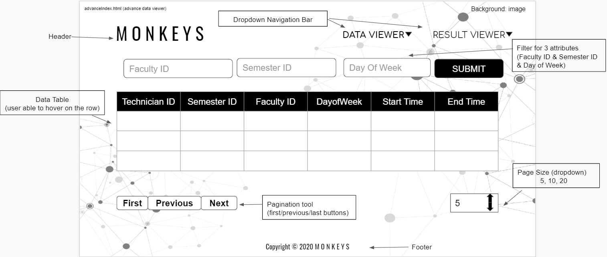

# Wireframe & Justification

This document should help you explain how your user interfaces are designed. You should have a wireframe to give a good overview and some screenshot with simple writeups to justify your designs.

## Wireframe

>Home Page (index.html)

> Advance Data Viewer (advanceIndex.html)

https://docs.google.com/presentation/d/10QNiZ2hRqsFZnx_hU2HSijMjdIX28StogJnGuYKSnSY/edit?usp=sharing

## Justifications

### Justification 1

https://www.bishopstrow.com/sample-timetables/
https://www.jotform.com/blog/data-tables-in-modern-web-design/ 

#### Good Points

1. There are alternate colors for each rows and each section which allows the user to read the data easily and scan through the data in a more efficient way. 
2. The width and height for each column and row are consistent. This provides the user to have a better visualization experience as the data are well laid out. 
3. The text in 1st column header and the 1st column of row are in bold and shaded grey in color which makes it easier for user to identify the main index column in the data table. 

#### Bad Points

1. There are two columns with different section of data are shown one shot in one page which might confuse the user as there are a lot of information in the table that might blend with each other. Perhaps each section of data can be put seperatedly in different pages/tab or increase the padding so that it will not confuse the user who is reading it.  
2. Search bar can be put on top of the data table which allows the user to search for what they want to improve the efficiency of findings. 
3. Pagination tool can be added to the data table as well so the user is able to choose how many data to be shown in one page and hence reduce the confusion and messiness of the data table. 

### Justification 2

https://www.bishopstrow.com/sample-timetables/
http://www.weicot.com/dev/guides/v2.0/pattern-library/displaying-data/datatable/datatable.html

#### Good Points

1. Pagination tools function are available for user to choose how many records does the user want to show in one page and also able to choose which page to read first. This allows the user to increase his/her work efficiency(as the user is able to organize the data) and provide a better user interface experience to the user. 
2. Search bar is available for user to search for the keyword of the data that user wish to find and the table will display only records that contain the designated keyword. 
3. Total number of items/records/data is shown above the column headers which gives an idea to the user about how many records are there in this table. 
4. User may filter specific columns within the table by selecting the Filter icon in the first row of the data table and this allows the user to do a quick search on the data that he/she wish to find. 

#### Bad Points

1. Adding 2 more search bar above the column headers might be good so that user can key in more attribute that he/she wishes to find. 
2. Paginaiton tool for the next and previous button can be placed under the data table so that when the user finsihes reading the last row of data, he/she does not have to scroll to the top of the data table to click for next page/previous page. 

### Justification 3

https://www.bishopstrow.com/sample-timetables/
https://onaircode.com/datatable-css-examples-code-snippet/

#### Good Points

1. Contains search bar which allows the user to enter the data that he/she wishes to find. This saves the user's time as he or she can avoid searching for the mass data one by one. 
2.  This data table contains dropdown menu for user to choose how many data to show in the table at once. This feature gives a good user experience. 
3. Checkbox are available in each column in the data table. This allows the users to tick the columns that they wish to read. It is a good feature when the users have to many various columns as this feature will reduce(hide) the columns and the user will only get to see the data columns that they wish to read. 
4. All columns contains sorting functions which allows the user to sort the columns in ascending/descending order. 

#### Bad Points

1. Adding 2 more search bar above the column headers might be good so that user can key in more attribute that he/she wishes to find. 
2. Alternate colors for odd and even rows can be implemented to the data table which gives a clearly visualization experience to the users. 
3. Next/previous/page number button can be implemented in this data table as well so that the user to hop over different pages anytime. 

