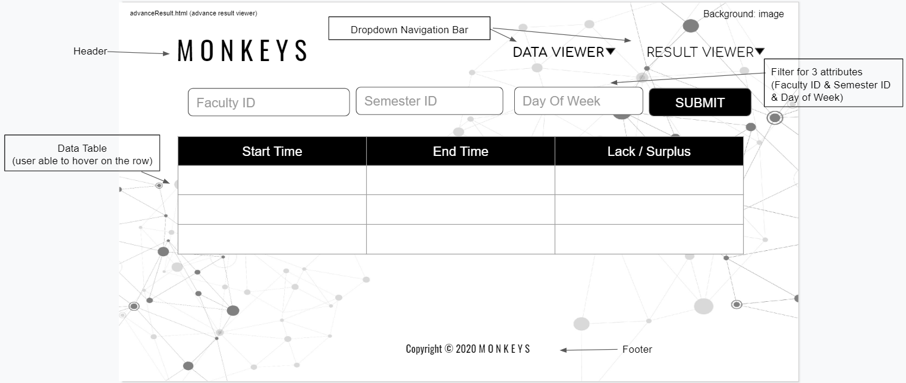

# Wireframe & Justification

This document should help you explain how your user interfaces are designed. You should have a wireframe to give a good overview and some screenshot with simple writeups to justify your designs.

## Wireframe

>Home Page (index.html)

> Advance Result Viewer (advanceResult.html)

https://docs.google.com/presentation/d/10QNiZ2hRqsFZnx_hU2HSijMjdIX28StogJnGuYKSnSY/edit?usp=sharing

## Justifications

### Justification 1

https://learn.shayhowe.com/html-css/organizing-data-with-tables/

#### Good Points

1. Header columns have different colors from the data rows which gives a contrast in color. This allows the user to differentiate the header and the data rows easily. 
2. The height and width for each column and rows are consistent which makes the user feel comfortable when reading it as the data information shown are well laid out. 
3. The text in the 1st column are in different colors as the rest of the columns. This allows the user to know which is the identifier of the rows and able to find the data easier.

#### Bad Points

1. Search filter may be neeeded in the tabular representation table so that user is able to search the item that they want in a shorter time. 
2. The tabular representation table will be good if there's a hover function to hover over the rows that the user if reading it. Hence, the user will not get lost/ get confused when reading the table. 

### Justification 2

https://learn.shayhowe.com/html-css/organizing-data-with-tables/

#### Good Points

1. Header columns have are bold up which allows user to know how to differentiate between parent headers, child headers and rows.
2. There are different shades between each data rows in the tabular representation table. This enables the user to read the data clearer as they will not mess up all the rows together. 
3. There is a filter/sorting function in the 'status' column which allows the user to sort the data with some condition. This is a good function as it saves user's time to search for the data that they wish to find. 
4. Special effects/design are applied to the 'Genre(s)' column. This able to catch user's attention and it gives the overview of the tabular table to be mroe organized and attractive. 

#### Bad Points

1. Search filter may be neeeded in the tabular representation table so that user is able to search the data that they want in a shorter time. 
2. The tabular representation table will be good if there's a hover function to hover over the rows that the user if reading it. Hence, the user will not get lost/ get confused when reading the table. 
3. It would more user friendly if all the columns in the table can be sorted in ascending/ descending order with the filter icon button. 

### Justification 3

https://learn.shayhowe.com/html-css/organizing-data-with-tables/
https://towardsdatascience.com/how-to-build-a-complex-reporting-dashboard-using-dash-and-plotl-4f4257c18a7f

#### Good Points

1. Contains attractive UI design with different colors but different sections. This enables the user to find the columns that they want to read easily. 
2. The columns and rows in tabular representative table have consistent height and width, data shown in the table are well laid out as the font size and font color of the data are readable. 
3. Contains checkbox on the 1st column of the table which allow the user to choose what data to be shown in the tabular representative table - User friendly and nice UX. 
4. Contains radio buttons on top of the header column of the table which allows the user to choose what type of data table to be shown in the page. 
5. There is a constrast in color (different color shades) within each columns which allows user to read the data easy and will not get consfused easily. 

#### Bad Points

1. Search bar may be neeeded in the tabular representation table so that user is able to get the data that they want in a shorter time. 
2. The width of the header column can be broader so that the text shown will be clearer but not squeezing each other. 
3. Adding a sort function to the columns that contains numbers/percentage might be good so that user is able to read the data from the highest percentage to the lowest and vice versa. 
