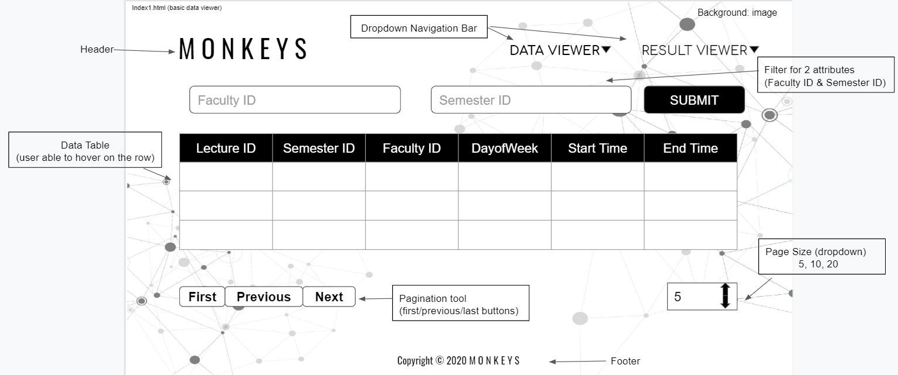

# Wireframe & Justification

This document should help you explain how your user interfaces are designed. You should have a wireframe to give a good overview and some screenshot with simple writeups to justify your designs.

## Wireframe
> Home Page (index.html)

> Data Viewer (index1.html)

https://docs.google.com/presentation/d/10QNiZ2hRqsFZnx_hU2HSijMjdIX28StogJnGuYKSnSY/edit?usp=sharing

## Justifications

### Justification 1

(http://tabulator.info/)

#### Good Points

1. Users are able to hide certain column can be useful for more efficient visualization. 
2. Pagination tool(Previous, Next, First Page buttons) meets the assignemnt requirement.
3. All the attributes can be sorted in ascending or descending order. 
4. Users are able to add rows/ undo the editing of the table.

#### Bad Points

1. Need more than 1 search bar as we need to search by multiple attributes.
2. Need Page Size pagination tool to show how many data we want to show in one page.
3. Data with text and icons are mixed together may look messy, should catagorized them instead. 
4. Having "Download Data as CSV" button at the top of the table may not be good and looks messy, it can be better if it is positioned at the bottom left corner of the table. 

### Justification 2

> 
(https://shiny.rstudio.com/gallery/basic-datatable.html)

#### Good Points

1. Pagination tools (First, Previous, Next, Page Size buttons) meets the requirement.
2. Showing total number of entries can be useful. 
3. All attributes are able to sort by ascending or descending order.
4. Users are able to get the data that they want in a faster way by having three filter dropdown menu. 

#### Bad Points

1. May need more than 1 search bar as we need to search by multiple attributes according to the requirement. 
2. Looks untidy to have too many dropdown filter menus on top of the table.
3. Dropdown filter menus need to indicate what attributes they are filtering so that they will not confuse the user.

### Justification 3

> 
(https://material.io/components/data-tables#anatomy)

#### Good Points

1. Pagination tool which contains page size adjustment and next previous buttons meet the requirement.
2. It shows the total number of entries and the number of rows at the current page might help some of the users
3. Spacing between each columns and rows are just nice, easy to read the data 
4. Able to filter the data by attributes which meets the requirement.
5. Interactive data table that allows the user to check the box of certain rows.
6. Attributes and data can be sorted in ascending/descending order.

#### Bad Points

1. May need one more "First" page button so that users can straight away brought to the 1st page instead of clickly the previous button for many times. 
2. Data table can be better if user is able to key in the values/data they want to filter instead of choosing it from the exisitng fitration function provided.
